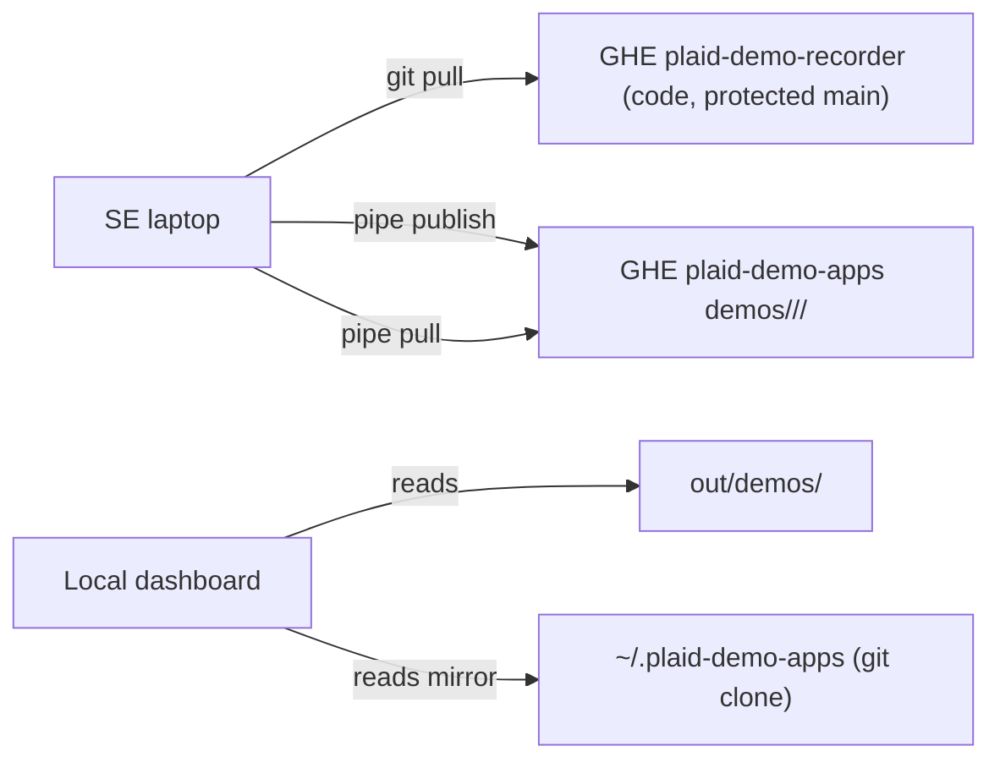
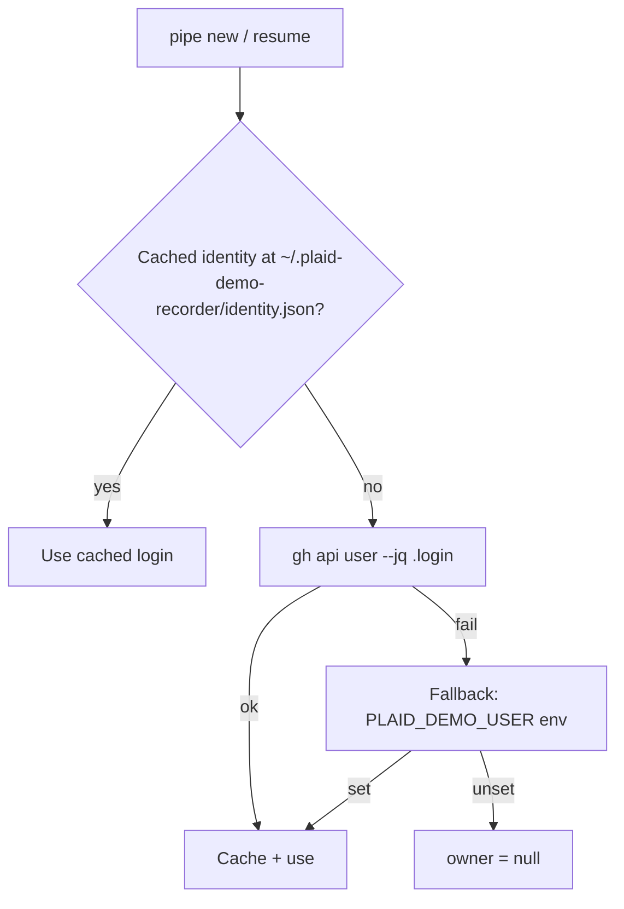
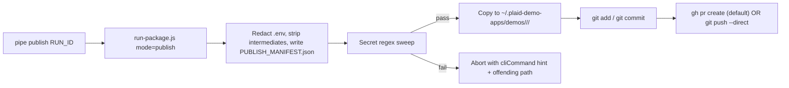

# Centralized Demo App Distribution Architecture

This document describes how a Plaid Sales Engineering team shares demo apps
built with the `plaid-demo-recorder` pipeline across laptops, without a central
auth server.

> Status: design complete. CLI (`pipe publish`, `pipe pull`, `pipe whoami`) and
> identity resolution (`~/.plaid-demo-recorder/identity.json`) have landed in
> this repository. Setup of the actual GitHub Enterprise `plaid-demo-apps`
> repository is an operator task; see [Operator checklist](#operator-checklist).

## Goals

1. Sales engineers run the pipeline locally (Playwright, Remotion Studio,
   ElevenLabs — all require a local machine).
2. Sales engineers can publish any of their local demos into a centralized
   repository other engineers can consume.
3. Sales engineers can pull the latest code updates AND the latest published
   demos from the same workflow.
4. Engineers cannot push arbitrary code changes — only their own published
   demos.
5. No bespoke auth server. Identity is mapped to GitHub Enterprise (GHE) login.

## Two-repo topology



- **`plaid-demo-recorder`** — this repository. Code only. Branch protection on
  `main` restricted to maintainers via CODEOWNERS. All SEs have read-only
  access. Pulled with `pipe pull`.
- **`plaid-demo-apps`** — new artifact repository. Contains only published
  demo bundles, one directory per user:
  ```
  demos/
    <ghe-login-a>/
      <runId-1>/
      <runId-2>/
    <ghe-login-b>/
      ...
  ```
  Every SE can push into `demos/<their-login>/**`. Only `@plaid/demo-maintainers`
  can modify anything outside that namespace.

## CODEOWNERS template for `plaid-demo-apps`

```
# Default fallback — only maintainers can modify the repo as a whole.
*                          @plaid/demo-maintainers

# Every user owns their own namespace. Engineers with branch access whose login
# matches the directory name can push without review.
/demos/<login>/**          @<login>
```

Combined with the branch protection rule below, CODEOWNERS is the sole
enforcement mechanism for "user only pushes into their own folder":

> Branch protection on `main`:
> - Require a pull request before merging
> - Require review from code owners
> - Restrict who can push to matching branches: `@plaid/demo-maintainers`
>
> Result: a normal SE must open a PR; their PR is auto-approved by CODEOWNERS
> only if every path they touch lives under `demos/<their-login>/**`. Any
> cross-user change waits for a maintainer review.

> The CLI (`pipe publish`) defaults to creating a PR via `gh pr create` rather
> than pushing to `main` so the CODEOWNERS contract is honored end-to-end. An
> `--direct-push` flag is available for users with direct-push privileges.

## Identity



Resolution order:

1. `~/.plaid-demo-recorder/identity.json` (cache from prior runs).
2. `gh api user` JSON → `login`, `name`. Requires `gh auth login` against
   the GHE host.
3. `PLAID_DEMO_USER` env var. Suitable for CI / headless.

Implementation: [scripts/scratch/utils/identity.js](../scripts/scratch/utils/identity.js).

On every `pipe new` / `pipe resume`, the orchestrator stamps the resolved
identity onto `run-manifest.json`:

```json
{
  "owner": { "login": "jane-doe", "name": "Jane Doe" }
}
```

Dashboard listings (`/api/demo-apps`, `/api/runs`) surface this as an `owner`
object. The dashboard's "Mine" toggle compares `app.owner.login` against
`/api/identity` (same identity resolver).

## Publishing workflow



### What is published

- `scratch-app/` (built HTML, CSS, JS, logo assets)
- `demo-script.json`, `playwright/playwright-script.json`
- `pipeline-run-context.json`
- `audio/voiceover.mp3`, final `mp4`
- `brand-extract.json` (public brand data only)
- `PUBLISH_MANIFEST.json` (summary — see below)
- `README.md` auto-generated from the run manifest + prompt

### What is NOT published

- `.env`, `.env.*` (always redacted to `.env.example` with empty values).
- `artifacts/logs/` (may contain prompt text with internal URLs).
- `research-notes.md`, `product-context.json` (may contain internal
  competitive notes or Solutions Master content).
- `frames/`, `qa-frames/`, any raw screenshot library over a configurable
  size threshold.
- `qa-report-*.json`, `build-qa-diagnostics.json` (diagnostic noise).
- The full `inputs/prompt.txt` by default (opt-in via `--include-prompt`).

### `PUBLISH_MANIFEST.json`

```json
{
  "runId": "2026-04-23-chase-funding-v3",
  "owner": { "login": "jane-doe", "name": "Jane Doe" },
  "buildMode": "app-only",
  "plaidLinkMode": "modal",
  "qaScore": 87,
  "publishedAt": "2026-04-23T22:45:10.123Z",
  "toolVersion": "plaid-demo-recorder@2026-04",
  "promptIncluded": false
}
```

The dashboard uses `PUBLISH_MANIFEST.json` as the list sentinel when scanning
`~/.plaid-demo-apps/demos/**/`.

## Secret redaction

`scripts/scratch/utils/run-package.js` (publish mode) runs a two-phase sweep:

1. Whitelist-only copy: only files from an allow-list are copied into the
   output directory.
2. Regex sweep over every copied file:
   - `/ANTHROPIC_API_KEY\s*=\s*\S/`
   - `/sk-[A-Za-z0-9-_]{20,}/`
   - `/PLAID_SECRET\s*=\s*\S/`
   - `/client_secret\s*[:=]\s*["']?[A-Za-z0-9]{16,}/`
   - `/ELEVENLABS_API_KEY\s*=\s*\S/`

Any match aborts the publish with an explicit error path and a
`::PIPE:: event=publish-blocked` structured event. The developer must redact
or exclude the offending file, then re-run `pipe publish`.

For CI / external invocation there is a standalone
`scripts/scratch/utils/check-publish-safety.js` that reuses the same rules.

## Dashboard integration

- `/api/demo-apps` now returns `owner`, `source: 'local'|'remote'`,
  `buildMode`, `plaidLinkMode`, `qaScore`, `promptViewerUrl`.
- Demo Apps tab shows two filters:
  - Search (debounced) across displayName / company / product / owner.
  - `All` vs `Mine` scope (falls back to `source==='local'` when identity
    cannot be resolved).
- Per-card badges show QA score (green ≥90, amber 70–89, red <70) and build
  mode (App-only vs App + Slides).
- A `Publish` button per card copies the CLI command when
  `DASHBOARD_WRITE` is off (default), or POSTs `/api/demo-apps/:runId/publish`
  when enabled.

## CLI surface

| Command | Purpose |
|---------|---------|
| `npm run pipe -- whoami` | Print resolved identity + clone paths. |
| `npm run pipe -- pull` | `git pull` on code repo AND on `~/.plaid-demo-apps`. Clones the artifact repo on first use. |
| `npm run pipe -- publish <RUN_ID> [--message=...] [--direct-push] [--include-prompt]` | Package, redact, push into `~/.plaid-demo-apps/demos/<login>/<runId>/`. |
| `npm run pipe -- unpublish <RUN_ID>` | Remove the published directory, commit, push / PR. |

Environment variables:

- `PLAID_DEMO_APPS_REPO` — HTTPS or SSH URL of the artifact repo. Default:
  none; `pipe pull` will error with a hint to set it.
- `PLAID_DEMO_APPS_DIR` — local clone location. Default: `~/.plaid-demo-apps`.
- `PLAID_DEMO_USER` / `PLAID_DEMO_USER_NAME` — override identity resolution.
- `GH_BIN` — override which `gh` binary is invoked (default `gh`).

## Operator checklist

To bring the centralized model online for a team:

1. Create `plaid-demo-apps` on GHE.
2. Commit a `README.md` and the `CODEOWNERS` template above. Tag the
   maintainers team in the first line (`/* @plaid/demo-maintainers`).
3. Add each SE to the GHE team that maps 1:1 with the `<login>` folders they
   are entitled to own. Simplest: one `@plaid-se-<name>` team per user, listed
   directly in CODEOWNERS. Harder but scalable: a `@plaid/se-writers` team
   with a CODEOWNERS bot that rewrites `/demos/<login>/**` ownership at PR
   time based on the author.
4. Configure branch protection on `main` (see "CODEOWNERS template" above).
5. Tell engineers:
   ```bash
   gh auth login --hostname <ghe-host>
   export PLAID_DEMO_APPS_REPO=git@ghe.plaid.com:plaid/plaid-demo-apps.git
   npm run pipe -- whoami   # verifies identity + artifact clone
   ```
6. Optional: add a GHE Actions workflow on `plaid-demo-apps` that rejects PRs
   that touch paths outside `demos/<pr-author-login>/**` as a defense-in-depth
   layer behind CODEOWNERS.

## Trust model

| Attack / mistake | Mitigation |
|------------------|------------|
| SE accidentally commits `.env` | Allow-list + regex sweep in `run-package.js` aborts publish. |
| SE tries to overwrite another user's demo | CODEOWNERS denies PR auto-approval; maintainer reviews. |
| SE tries to push code to `plaid-demo-recorder` | Branch protection + CODEOWNERS `*` rule. |
| Identity spoofing by setting `PLAID_DEMO_USER` | Cosmetic only — GHE still signs the push. Receiving side trusts the git committer, not `owner` metadata. |
| Lost laptop | `gh auth` credentials + any Plaid secrets in `.env` are local; published bundle has no secrets, so no leakage from the artifact repo. |

## Migration plan

Ship in two sub-releases as described in the plan:

1. **Release D.1** — `identity.js`, `run-package.js` publish mode,
   `check-publish-safety.js`, `pipe publish/pull/unpublish/whoami` CLIs. No
   dashboard UI yet. Engineers can publish from the terminal.
2. **Release D.2** — dashboard Publish button, "All / Mine" toggle, remote
   source listings, Pull header action. Also moves the legacy
   `/api/runs/:runId/download-app-package` to use the shared `run-package.js`
   with `mode: 'local'` (no secret redaction — existing behavior preserved).
